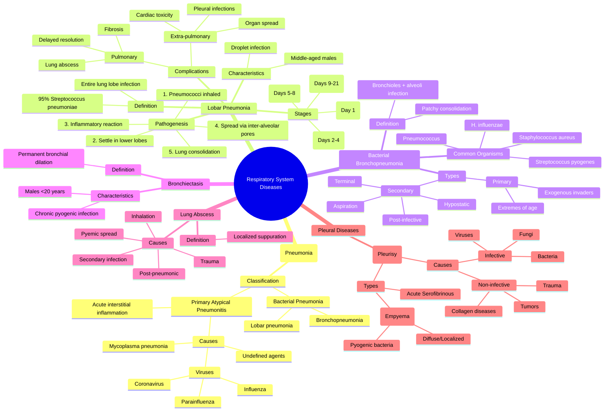

```mermaid
mindmap
  root((Respiratory System Diseases))
    Pneumonitis (Pneumonia)
      Classification
        Bacterial Pneumonia
          Lobar pneumonia
          Bronchopneumonia
        Primary Atypical Pneumonitis
          Acute interstitial inflammation
          Causes
            Viruses
              Influenza
              Parainfluenza
              Coronavirus
            Mycoplasma pneumonia
            Undefined agents
    Lobar Pneumonia
      Definition
        Entire lung lobe infection
        95% Streptococcus pneumoniae
      Characteristics
        Middle-aged males
        Droplet infection
      Pathogenesis
        1. Pneumococci inhaled
        2. Settle in lower lobes
        3. Inflammatory reaction
        4. Spread via inter-alveolar pores
        5. Lung consolidation
      Stages
        1. Congestion (Day 1)
        2. Red Hepatization (Days 2-4)
        3. Gray Hepatization (Days 5-8)
        4. Resolution (Days 9-21)
      Complications
        Pulmonary
          Delayed resolution
          Fibrosis
          Lung abscess
        Extra-pulmonary
          Pleural infections
          Organ spread
          Cardiac toxicity
    Bacterial Bronchopneumonia
      Definition
        Bronchioles + alveoli infection
        Patchy consolidation
      Types
        Primary
          Exogenous invaders
          Extremes of age
        Secondary
          Post-infective
          Aspiration
          Hypostatic
          Terminal
      Common Organisms
        Staphylococcus aureus
        Streptococcus pyogenes
        Pneumococcus
        H. influenzae
    Bronchiectasis
      Definition
        Permanent bronchial dilation
      Characteristics
        Males <20 years
        Chronic pyogenic infection
    Lung Abscess
      Definition
        Localized suppuration
      Causes
        Inhalation
        Pyemic spread
        Post-pneumonic
        Secondary infection
        Trauma
    Pleural Diseases
      Pleuritis (Pleurisy)
        Causes
          Infective
            Bacteria
            Viruses
            Fungi
          Non-infective
            Collagen diseases
            Trauma
            Tumors
        Types
          Acute Serofibrinous
          Suppurative (Empyema)
            Pyogenic bacteria
            Diffuse/Localized
```